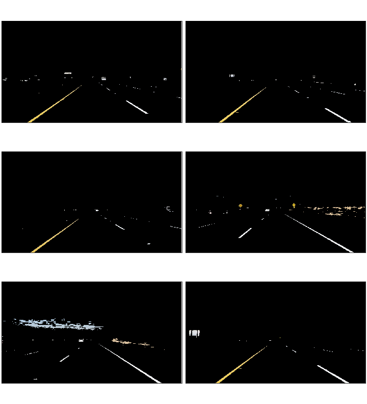

### Reflection

###1. Describe your pipeline. As part of the description, explain how you modified the draw_lines() function.

At first the image gets converted to the HLS color space. This allows me to filter yellow and white better, even in darker parts e.g. shadows.
I chose the HLS space because it is better suited for filtering colors and made the lanes stick out more than other color spaces. 

For best results from the Canny Edge Detection it is recommended to apply the filter to an image in gray scale.
I additionally applied a Gaussian filter to reduce waste edges from noise by blurring the pixels.
Instead of manually optimizing the parameters for the Canny algorithm, I used an simple trick from 
[pyimagesearch.com](http://www.pyimagesearch.com/2015/04/06/zero-parameter-automatic-canny-edge-detection-with-python-and-opencv/). 
It builds the upper and lower limit by calculating the median of all pixels and adds and accordingly removes a percentage of it.  

  

With all lines on the frame detected I then defined a region of interest which covers the lane the car is driving in. All pixels but those within the region
get set to zero. This leaves the detected lane lines in white on a black background.
To draw lines on an image, opencv needs two points, start and end point of the line as tuples of x- and y-coordinates,
which are determined by applying the Hough Transformation. This function yields several individual lines on the detected edges.
The lines, which are provided as two tuples of coordinates, were grouped in positive, right-hand, and negative, left-hand, slopes. 
With *numpys* least-squares solution [lstsq](https://docs.scipy.org/doc/numpy/reference/generated/numpy.linalg.lstsq.html#numpy.linalg.lstsq) 
it is possible to compute slope and bias for the average line through the provided points.
The necessary points can be calculated by solving the equation `` y = m * x + b `` for y. With the resulting equation, ``x = (y - b) / m ``, 
the intersecting points with the lower border and the point in the center of the image can be computed.
To consider longer or shorter lane lines, e.g. driving up or down a hill, the y-value of the center points is determined by mean of last five highest
y-values of detected points or a fixed value, depending which is higher. This enables variable line length but keeps the length steady when the car hits a bump.
With *opencvs* line function the calculated points are drawn on the image within a region to avoid a intersection of the line.

###2. Identify potential shortcomings with your current pipeline

The pipeline has problems with steep and very winding roads and sharp turns.  
Possible further shortcomings are dark roads or alternating lighting conditions.

###3. Suggest possible improvements to your pipeline

A possible improvement could bring the flatten of the image or a region to make the lanes parallel. 
This way detecting and drawing lines would be easier for bent lines. 
